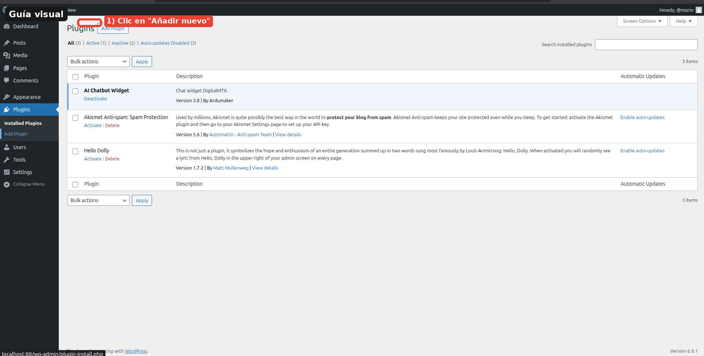
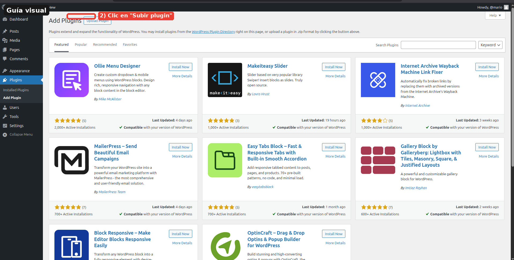
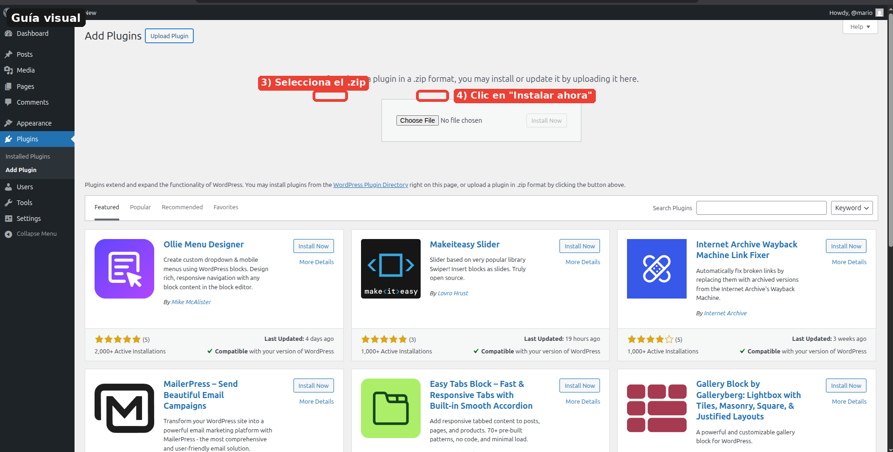
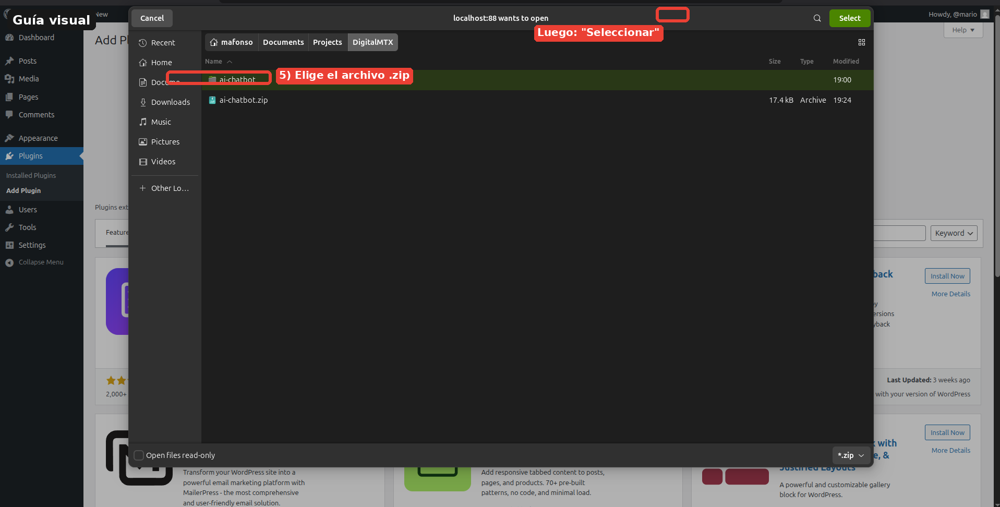
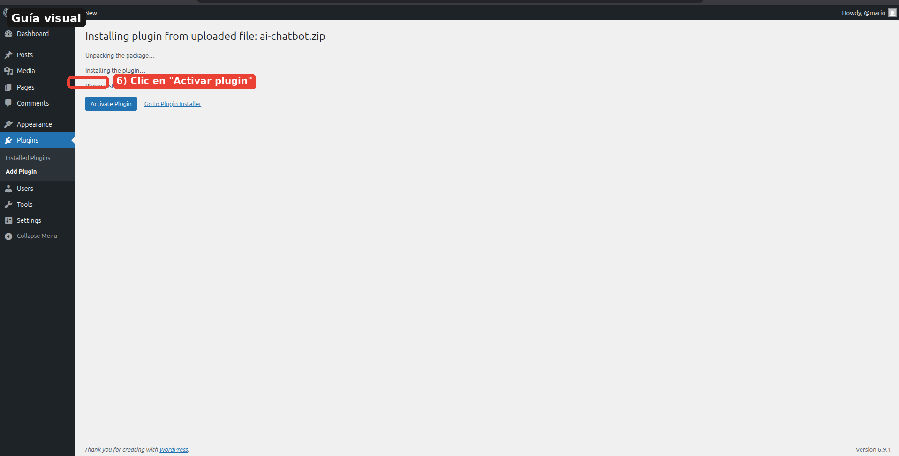

# instalador de plugin

## Instalar plugin — Instalar mediante subida de archivo `.zip`

Usa este método cuando tengas el plugin en formato `.zip` (adquirido fuera del repositorio oficial, por ejemplo).

**Paso a paso:**

1. Ve a **Plugins** → **Añadir nuevo**
2. Haz clic en el botón **Subir plugin** (en la parte superior de la página)
3. Haz clic en **Seleccionar archivo** y elige el archivo `.zip` del plugin
4. Haz clic en **Instalar ahora**
5. Una vez finalizada la instalación, haz clic en **Activar plugin**

> ⚠️ Asegúrate de que el archivo `.zip` provenga de una fuente confiable para evitar riesgos de seguridad.

## Guía visual

### 1) Ir a Plugins → Añadir nuevo

### 2) Clic en Subir plugin

### 3) Seleccionar archivo .zip y luego Instalar ahora

### 4) Elegir el archivo .zip en el selector del sistema

### 5) Activar plugin

